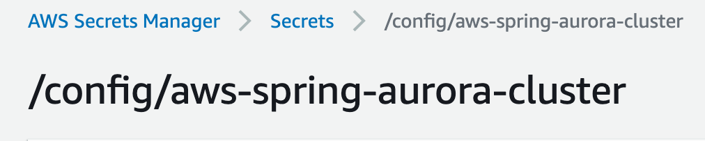
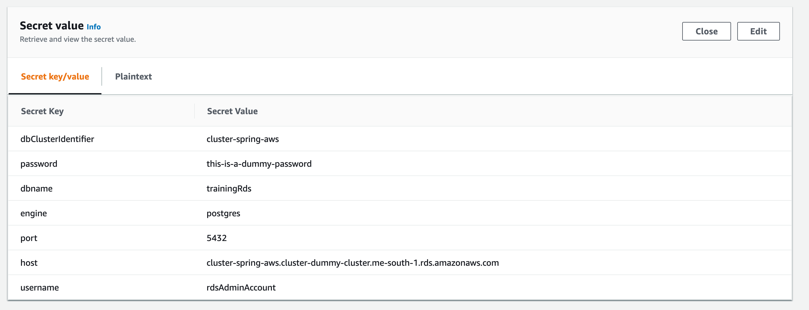
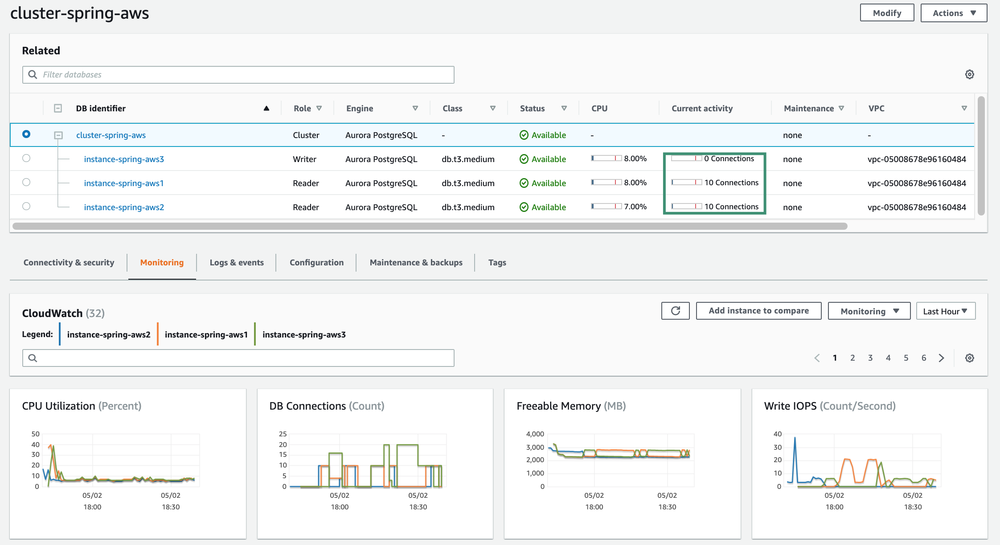

#### What is it?

This is a sample Spring Cloud application to test the Aurora RDS in multi-AZ scenario.
The infrastructure for this project is based on the following project:

https://github.com/stokilo/aws-cdk-rds-vpn

It was adjusted with RDS settings for storing database secrets, and different cluster sizes to test failover.

The application configures two data sources, one for a writer endpoint and one for a reader. 
The database is located in an isolated subnet and a Vpn connection is required to test it. Setup is described under
/infrastructure module.

Please note, this is an experimental project created while preparing for the AWS exam.
More details on blog slawomirstec.com

### Sprint Cloud read replica setup

In the current version, Spring Cloud replica configuration is not working for AWS Aurora clusters:

https://github.com/spring-cloud/spring-cloud-aws/issues/356

it is included in milestone 3.0.x that is at the time of writing at 31% of completion.

Suggested solutions are described in the following blogs:

https://vladmihalcea.com/read-write-read-only-transaction-routing-spring/

https://fable.sh/blog/splitting-read-and-write-operations-in-spring-boot/

These solutions are not implemented in this project, I implement a simple failover handler class that
monitors writer endpoint errors, in such cases, the connection pool is evicted. This solution can be found
in the class:

    PostgresFailoverAspect

it is currently disabled, I decided to give a try to new AWS JDBC driver for Postgres
(fresh 0.1.0 release, not production ready yet) which supports failover, more details on official Github page:

    https://github.com/awslabs/aws-postgresql-jdbc

This project configures two data sources, one for the writer and one for the reader endpoint. 
Service functions annotated with @Transactional annotation like presented below:

     @Transactional(value = TransactionalOverReadReplica.READ_REPLICA)

will be routed to the read replica data source, otherwise to the writer node.

#### Secret manager integration

The database secret is created during CDK setup, assigned name: /config/aws-spring-aurora-cluster

Values of the auto-generated password are fetched from AWS on Spring startup time.

The secret manager stores the secret as an array of key/values, a password is one of the keys. Keys are referenced
it in properties as ${password} ${port} ${dbname} ${username}. Spring cloud resolves '/config/aws-spring-aurora-cluster' and then
'/config/application', sample content of the secret generated with CDK on screen shoots below.

#### How to test?

Run application using shell script

    ./run.sh

if you want to run it form IDE instead of the shell script, then pass JVM argument -Djava.security.properties=java.custom.security

Test writer node

    curl -X POST localhost:8081/user

Test reader node

    curl localhost:8081/user

Insert 1 user every second with watch command

    watch -n 1 curl -X POST localhost:8081/user

Query last 10 users every second with watch command

    watch -n 1 curl localhost:8081/user

Monitor AWS console for a number of connections and read/write IOPS.

#### Failover

Before failover testing, ensure connection is going through reader and writer instances like on screen shoot below:

Then test it like following:

    1. Start application
    2. Run watch commands for read and writes
    3. Login to AWS console and select writer -> Failover

###### Failover with PostgresFailoverAspect

In case 2 instances are running (one for writer and one for the reader), the reader will be appointed as writer and writer
as reader. Aurora will restarts writer instance and for some time, reader and writer will point to that same IP (read replica
IP). This is because only two instances are in the cluster, this is not true for clusters with more instances running.

Pending connections with write transactions will be evicted once Postgres will throw an error on an attempt
of writing to the read replica. This is implemented in aspect PostgresFailoverAspect, I check there to Postgres specific
database error.

Such error will not be reported for read transactions, this can cause the read replica is not used anymore after failover.
Active pool connections are working even after failover and accept connections. However, now they point to the writer endpoint.

I don't handle pool eviction for the reader endpoint in this project. A simple solution is to implement a REST endpoint to
evict all connections from the reader data source.

Another solution I can think of is to monitor reader.rds.com IP and evict the connection pool when change
is detected. Such a task could run i.e. every minute to keep recovery time as short as possible.

I implemented this solution because it was the simples one for my testcase. JDBC level solution is described in next 
point.

###### Failover with AWS PostgresSQL JDBC driver

This is a new driver released week ago. It supports custom domain name for JDBC URL but it didn't work for me after failover,
my connections were terminated. However, setting cluster reader/writer endpoint DNS name worked. I configured
two data sources, reader and writer, failover worked for both same way as for my custom PostgresFailoverAspect
implementation.

